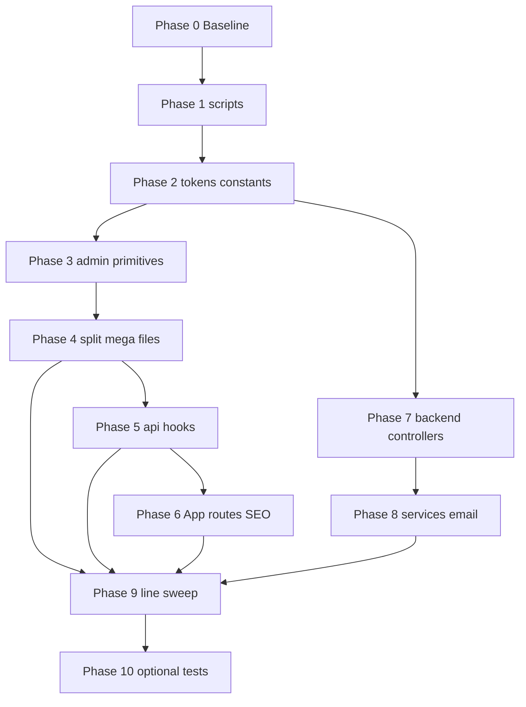

# Refactoring analysis — civil-ecommerce

This document summarizes the current codebase so refactoring can be planned without guessing. It aligns with the Cursor rules in `.cursor/rules/dry-and-project-standards.mdc` (DRY, reuse, shared constants, `scripts/` for non-UI checks, no regressions, ≤200 lines per file where practical).

## Refactoring progress (incremental)

Refactoring is **in progress**. Goal: no behavior or UI regressions; split files over **200 lines** using shared utilities and components; re-verify after each batch.

**Done so far**

- **SweetAlert2 DRY**: Extended `frontend/src/utils/swal.ts` (static import, shared helpers). Destructive confirm colors live in `frontend/src/constants/swalTheme.ts`. Prefer `swalConfirm`, `swalSuccess`, `swalError`, `swalConfirmSimple`, `swalConfirmDestructive`, `swalSuccessBrief`, and `swalFire` instead of scattering `import Swal from "sweetalert2"` and one-off `Swal.fire(...)` calls. Existing callers (`components/admins/*`) keep the same `swalSuccess(message, title?)` argument order.
- **Admin users screen**: `frontend/src/ui/admin/users/UserManagement.tsx` split into composable pieces and brought **under 200 lines**: `UserManagementToolbar.tsx`, `UserRegistrationDateFilter.tsx`, `UserManagementUsersPanel.tsx`, `useUserManagementExport.ts`, plus `frontend/src/utils/filterByRegistrationDate.ts` for the date-range filter logic.
- **Regression gate**: Repo root `scripts/verify.mjs` runs `npm run build` in `frontend/` and `backend/`. From the repo root: `node scripts/verify.mjs`.
- **Admin reviews**: `frontend/src/ui/admin/Reviews.tsx` is a thin page (~100 lines); logic lives in `reviews/useAdminReviewsPage.ts`. UI pieces: `reviews/ReviewsToolbar.tsx`, `ReviewEditModal.tsx`, `ReviewStarRating.tsx`. Alerts use `utils/swal.ts` + `utils/axiosErrorMessage.ts`. `ReviewTable.tsx` renders stars via `ReviewStarRating` (removed `renderStars` prop); product column typing no longer uses `any`.
- **Admin coupons**: `frontend/src/ui/admin/coupons/Coupons.tsx` is layout-only (~113 lines). CRUD + fetch + SweetAlert timing live in `useCouponsAdmin.ts`; modal split into `CouponFormModal.tsx`, `CouponFormBasicFields.tsx`, `CouponFormDiscountFields.tsx`, `CouponFormProductsSection.tsx`, `CouponFormStatusFooter.tsx`, plus `types.ts`, `couponDisplayUtils.ts`, `couponFormValidation.ts`, `couponApiBase.ts`, `CouponCard.tsx`, `CouponsHeader.tsx`, `CouponsStats.tsx`, `CouponsEmptyState.tsx`. Coupon alerts use `swalFire` for unchanged timers/colors. **Bugfix:** `AdminPagination` was rendered inside each coupon card; it now renders once below the list.
- **Admin orders**: `frontend/src/ui/admin/Orders.tsx` is a thin shell (~106 lines). Logic lives in `orders/useAdminOrdersPage.ts` and `orders/useAdminOrderCreateForm.ts`; export date-range logic in `orders/useAdminOrdersExport.ts`; pure helpers in `orders/adminOrderUtils.ts`. UI modules under `frontend/src/ui/admin/orders/` include toolbar (`OrdersPageToolbar`, `OrdersExportRangeFields`, `OrdersExportMenu`), table (`OrdersDataTable`, `OrderTableRow`), stats, bulk bar, search, loading, create-order modal sections, and `OrderDetailsModal` parts. SweetAlert usage moved to `utils/swal.ts` / `utils/axiosErrorMessage.ts`. **Removed** per-render `console.log` of the first order (was noisy and could hurt performance).
- **Admin products list**: `frontend/src/ui/admin/products/Products.tsx` is a thin shell (~110 lines). List/filter/pagination/selection/CRUD toggles live in `useAdminProductsPage.ts`; Excel/JSON export in `useAdminProductsExport.ts`; pricing display helpers in `adminProductPricingDisplay.ts`; client-side filter in `filterAdminProductsPageList.ts`. UI: `ProductsPageStatsRow.tsx`, `ProductsPageToolbar.tsx`, `ProductsPageTable.tsx`, `ProductTableRow.tsx`, `ProductTablePricingCell.tsx`. Alerts use `utils/swal.ts` and `utils/axiosErrorMessage.ts`.
- **Add / edit product modal (incremental)**: `frontend/src/ui/admin/products/AddProductModal.tsx` is now a thin composer (~290 lines); `addProductModal/` holds data/save modules, form hooks, and UI sections including **deal/discount** (`AddProductModalDealSection` + datetime / ebook / subscription-duration / lifetime / membership / admin-sub deal blocks), **free product (homepage)**, **media**, **FAQ**, **auto-save row**, and **sticky footer** (draft / submit / cancel). Confirm/validation/draft toasts use `utils/swal.ts`. **Next** (optional polish): header shell component, or move modal to lazy route chunk.

**Next suggested slices** (same pattern: shared `utils/swal` + section components + hooks): further `AddProductModal.tsx` sections, then `pages/ProductDetail.tsx` and other register items.

### Files completed toward the ≤200-line target

| Module | Notes |
|--------|--------|
| `frontend/src/ui/admin/users/UserManagement.tsx` | Was ~431 lines; orchestration only; UI and export logic extracted. |
| `frontend/src/ui/admin/Reviews.tsx` | Was ~376 lines; toolbar, edit modal, star row, and page hook extracted. |
| `frontend/src/ui/admin/coupons/Coupons.tsx` | Was ~1237 lines (incl. inline modal); split into coupons module + pagination fix. |
| `frontend/src/ui/admin/Orders.tsx` | Was ~2000+ lines; split into `orders/*` hooks and components (see progress note above). |
| `frontend/src/ui/admin/products/Products.tsx` | Was ~1275 lines; split into hooks + table/stats/toolbar pieces; `useAdminProductsPage.ts` is still >200 lines (candidate for further split). |

The historical **88-file register** below still lists other oversize files; treat it as a backlog and re-run line-count analysis before a wide sweep.

## Repository shape

- **Frontend**: `frontend/` — React 19, Vite, TypeScript, Tailwind 4, TanStack Query, React Router.
- **Backend**: `backend/` — Express (TypeScript compiled to `dist/`), Mongoose, assorted services (email, Drive, payments).

There is no single shared package between apps; duplication can appear as parallel patterns in `frontend/src/api/` and `backend/controllers/`.

## Full codebase inventory (analyzed scope)

Everything below was **included in analysis** for this document: counts exclude `node_modules/`, `dist/`, and `.git`. Refactors focus on **source**; build output and dependencies are out of scope.

### Application source (primary refactor target)

| Location | Contents | Approx. code files |
|----------|----------|--------------------|
| `frontend/src/` | React app | **271** (185 `.tsx`, 78 `.ts`, 8 `.css`) |
| `backend/` (TS source only) | Express API | **72** `.ts` under source folders (not `dist/`) |

**`frontend/src/` — every top-level area**

| Path | Role |
|------|------|
| `components/` | Shared UI: `common/`, `Header/`, `Footer/`, `blog/`, `orders/`, `layout/`, `sections/`, `admins/`, `RichTextEditor/`, `SCrm/`, `WelcomePopup/`, etc. |
| `ui/` | Feature composites: **`admin/`** (orders, products, coupons, users, banner, reviews, cart management, enquiries, dashboard), **`home/`**, **`Cart/`**, **`checkout/`**, **`profile/`**, **`policy/`**, **`ScrmSection/`**, **`payment/`** |
| `pages/` | Route pages: storefront, **`auth/`**, blog, superadmin, cart, checkout |
| `api/` + `api/types/` | HTTP clients and DTO types |
| `hooks/`, `contexts/` | React hooks and providers |
| `utils/`, `constants/`, `types/` | Helpers, copy/constants, shared types |
| `assets/`, `styles/` | Static assets, global styles |
| `services/` | `api.ts` (single file — keep consistent with `api/`) |
| Root files | `App.tsx`, `main.tsx`, `index.css`, `vite-env.d.ts` |

**Every file under `frontend/src/pages/` (30 route modules — all reviewed for this doc)**

`AboutPage.tsx`, `AdminBlogForm.tsx`, `AdminBlogList.tsx`, `adobecloudpage.tsx`, `AllProductsPage.tsx`, `BlogDetailPage.tsx`, `BlogListPage.tsx`, `BrandCategoryListing.tsx`, `BrandSubcategoriesPage.tsx`, `CartPage.tsx`, `CheckoutPage.tsx`, `ContactPage.tsx`, `Deals.tsx`, `HomePage.tsx`, `HowToPurchase.tsx`, `MyOrdersPage.tsx`, `PartnerProgram.tsx`, `PaymentMethod.tsx`, `PaymentStatusPage.tsx`, `ProductDetail.tsx`, `SitemapPage.tsx`, `SuperAdminAdminsPage.tsx`, `SuperAdminCreateAdminPage.tsx`, `SuperAdminDashboard.tsx`, `UserEnquiriesPage.tsx`, and under `pages/auth/`: `AuthCallbackPage.tsx`, `ForgotPasswordPage.tsx`, `PasswordResetPage.tsx`, `SigninPage.tsx`, `SignupPage.tsx`.

**`backend/` — every module directory (all files counted)**

| Path | Count | Role |
|------|------:|------|
| `controllers/` | 17 | `authController`, `analyticsController`, `billingAddressController`, `blogController`, `cartController`, `contactController`, `couponController`, `dealsController`, `enquiryController`, `freeProductsController`, `leadController`, `menuController`, `paymentController`, `productController`, `reviewController`, `superadminController`, `userController` |
| `routes/` | 19 | `auth`, `analytics`, `banner`, `billingAddress`, `blog`, `cart`, `contact`, `coupon`, `deals`, `download`, `enquiry`, `freeProducts`, `lead`, `menu`, `payment`, `product`, `review`, `superadmin`, `user` (+ `*Routes.ts` suffix) |
| `models/` | 13 | `User`, `Product`, `Order`, `Cart`, `Coupon`, `Review`, `Blog`, `Menu`, `Lead`, `Enquiry`, `BillingAddress`, `Contact`, `Banner` |
| `services/` | 5 | `emailService`, `driveService`, `cashfreeService`, `viewerTracker`, `bannerApi` |
| `scripts/` | 8 | See [Backend scripts](#backend-scripts-inventory) |
| `middlewares/` | 1 | `auth.ts` |
| `utils/` | 4 | Includes `emailTemplate`, `orderEbookStatus`, `downloadEligibility`, etc. |
| `config/` | 1+ | Passport / server configuration |
| `types/`, `constants/` | small | Shared types and constants |
| `server.ts` | 1 | HTTP server entry |

**Backend assets / build (awareness, not refactor targets)**

- `backend/email-images/` — static images for email templates.
- `backend/dist/` — compiled JS; regenerated by `npm run build`.

### Frontend config and docs (awareness)

| Path | Notes |
|------|------|
| `frontend/vite.config.ts`, `tsconfig*.json`, `index.html`, `vercel.json` | Build and deploy |
| `frontend/README.md`, `frontend/ADMIN_THEME_README.md`, `frontend/src/ui/Cart/README.md` | Human docs |

### Repo root documentation (awareness)

Markdown guides at repo root (`SEO_*`, `DEAL_*`, `GOOGLE_*`, `DOWNLOAD_*`, `QUICK_START.md`, `ADMIN_UI_REFERENCE.md`, `SECURE_DOWNLOAD_COMPLETE.md`, `COUPON_*`, `backend/REVIEW_INDEX_FIX.md`, etc.) are **in scope for context** when refactoring related features; they are not executable source.

### Backend scripts inventory

All under `backend/scripts/` (wired where noted in `backend/package.json`):

| Script file | Typical use |
|-------------|-------------|
| `migrate-admin-permissions.ts` | Permissions migration |
| `seed-menus.ts` | Menu seeding (`seed:menus`) |
| `drop-review-unique-index.ts` | DB index fix (`script:drop-review-index`) |
| `setup-test-data.ts` | Local / staging data |
| `fix-order-product-ids.ts`, `fix-order-numbers.ts`, `cleanup-orders.ts` | Order data repairs |
| `view-orders.ts` | Operational inspection |

### “All other” modules

Roughly **247** `.ts` / `.tsx` / `.js` / `.jsx` files under `frontend/src` and `backend` are **≤ 200 lines** today. Phase 9 is the systematic pass across **every remaining file** in the directories above, not only the oversized ones.

## Automated testing status

- **Backend** `package.json` defines `"test"` as a placeholder (no real test runner configured in that script).
- **Frontend** has `lint`, `build`, and Prettier scripts; no Jest/Vitest-style unit suite surfaced in `package.json` at the time of this analysis.

**Implication**: refactors should lean on `lint` / `build`, manual smoke checks, and new **non-UI scripts** under a top-level `scripts/` folder (or `backend/scripts/` when appropriate) until a formal test framework is adopted.

## Line-count policy vs current state

A full scan of `frontend/src` and `backend` (excluding `node_modules`, `dist`, `.git`) counted **335** `.ts` / `.tsx` / `.js` / `.jsx` files. Of those, **88** exceed **200 lines** and **247** are at or below 200 lines.

Bringing every file under 200 lines is a **multi-phase** effort. Prioritize highest churn and risk: admin orders/products, checkout, product detail, payments, and shared header/cart UI.

### Complete register: TypeScript/JavaScript files over 200 lines (88)

Every path in this table is explicitly in scope for Phases 4–9 (frontend) and 7–9 (backend). Line counts are approximate and will drift; re-run the analyzer before a major sweep.

| Lines (approx.) | Path |
|----------------:|------|
| 4800 | `frontend/src/pages/ProductDetail.tsx` |
| 3093 | `frontend/src/ui/admin/products/AddProductModal.tsx` |
| ~~2132~~ → **≤200** | `frontend/src/ui/admin/Orders.tsx` — *split into `orders/*`; see [Files completed](#files-completed-toward-the-200-line-target)* |
| 1544 | `backend/controllers/paymentController.ts` |
| 1343 | `frontend/src/ui/admin/products/Products.tsx` |
| ~~1237~~ → **≤200** | `frontend/src/ui/admin/coupons/Coupons.tsx` — *split into `coupons/*`; see [Files completed](#files-completed-toward-the-200-line-target)* |
| 865 | `frontend/src/pages/CheckoutPage.tsx` |
| 795 | `frontend/src/ui/admin/Dashboard.tsx` |
| 782 | `frontend/src/ui/admin/products/ProductViewModal.tsx` |
| 757 | `frontend/src/ui/admin/EnquiryManagement.tsx` |
| 734 | `backend/services/emailService.ts` |
| 723 | `frontend/src/pages/auth/PasswordResetPage.tsx` |
| 704 | `backend/controllers/productController.ts` |
| 685 | `frontend/src/ui/admin/products/DraftProducts.tsx` |
| 639 | `backend/controllers/reviewController.ts` |
| 592 | `frontend/src/pages/ContactPage.tsx` |
| 563 | `frontend/src/pages/BrandCategoryListing.tsx` |
| 517 | `backend/controllers/analyticsController.ts` |
| 515 | `backend/routes/downloadRoutes.ts` |
| 498 | `frontend/src/ui/profile/ProfilePage.tsx` |
| 475 | `frontend/src/pages/auth/SignupPage.tsx` |
| 466 | `frontend/src/pages/AllProductsPage.tsx` |
| 450 | `frontend/src/components/Footer/Footer.tsx` |
| 438 | `backend/controllers/blogController.ts` |
| ~~431~~ → **≤200** | `frontend/src/ui/admin/users/UserManagement.tsx` — *split complete; see [Files completed](#files-completed-toward-the-200-line-target)* |
| 424 | `frontend/src/pages/AdminBlogForm.tsx` |
| 419 | `frontend/src/App.tsx` |
| 408 | `backend/controllers/cartController.ts` |
| 388 | `frontend/src/components/IconPicker/IconPicker.tsx` |
| 383 | `frontend/src/components/LeftSidebar/LeftSidebar.tsx` |
| 380 | `frontend/src/components/Header/Header.tsx` |
| 378 | `frontend/src/ui/Cart/CartItem.tsx` |
| ~~376~~ → **≤200** | `frontend/src/ui/admin/Reviews.tsx` — *split; see [Files completed](#files-completed-toward-the-200-line-target)* |
| 368 | `frontend/src/ui/admin/users/AddUserModal.tsx` |
| 367 | `frontend/src/pages/auth/ForgotPasswordPage.tsx` |
| 353 | `frontend/src/components/admins/MenuManagement.tsx` |
| 347 | `frontend/src/components/CategoryTabs/CategoryTabs.tsx` |
| 345 | `backend/services/driveService.ts` |
| 341 | `frontend/src/components/Header/AllCategoriesDropdown.tsx` |
| 339 | `frontend/src/utils/seo.ts` |
| 338 | `frontend/src/ui/admin/Banner.tsx` |
| 336 | `backend/controllers/authController.ts` |
| 329 | `frontend/src/ui/admin/banner/BannerCarousel.tsx` |
| 328 | `frontend/src/components/RelatedProducts.tsx` |
| 326 | `backend/controllers/enquiryController.ts` |
| 325 | `frontend/src/components/WelcomePopup/WelcomePopup.tsx` |
| 320 | `frontend/src/components/orders/ProductInfo.tsx` |
| 298 | `frontend/src/ui/admin/BannerForm.tsx` |
| 294 | `frontend/src/hooks/useCart.ts` |
| 291 | `frontend/src/contexts/CartContext.tsx` |
| 289 | `frontend/src/components/Header/MobileCategoriesMenu.tsx` |
| 286 | `frontend/src/pages/UserEnquiriesPage.tsx` |
| 281 | `frontend/src/components/RichTextEditor/RichTextEditor.tsx` |
| 276 | `frontend/src/pages/auth/SigninPage.tsx` |
| 270 | `frontend/src/api/productApi.ts` |
| 267 | `backend/routes/bannerRoutes.ts` |
| 265 | `frontend/src/ui/checkout/BillingForm.tsx` |
| 263 | `frontend/src/components/Header/DesktopNavigation.tsx` |
| 257 | `frontend/src/pages/BrandSubcategoriesPage.tsx` |
| 255 | `frontend/src/components/Header/AutodeskDropdown.tsx` |
| 254 | `frontend/src/components/FeaturedProducts/FeaturedProducts.tsx` |
| 253 | `frontend/src/ui/home/Reviews.tsx` |
| 251 | `backend/services/cashfreeService.ts` |
| 251 | `backend/controllers/couponController.ts` |
| 242 | `frontend/src/ui/home/FreeProductsSection.tsx` |
| 241 | `frontend/src/components/Header/AdobeDropdown.tsx` |
| 239 | `frontend/src/constants/productFormConstants.ts` |
| 237 | `frontend/src/components/Header/MicrosoftDropdown.tsx` |
| 237 | `frontend/src/components/Header/AntivirusDropdown.tsx` |
| 235 | `backend/models/Product.ts` |
| 228 | `frontend/src/ui/admin/AdminDashboard.tsx` |
| 224 | `frontend/src/ui/admin/users/UserTable.tsx` |
| 224 | `frontend/src/components/EnquiryModal.tsx` |
| 215 | `frontend/src/pages/AdminBlogList.tsx` |
| 215 | `frontend/src/components/sections/TestimonialsSection.tsx` |
| 214 | `frontend/src/ui/checkout/OrderSummary.tsx` |
| 213 | `frontend/src/ui/Cart/CartSummary.tsx` |
| 213 | `frontend/src/pages/SitemapPage.tsx` |
| 212 | `frontend/src/components/Header/ProductSearchBar.tsx` |
| 211 | `frontend/src/api/auth.ts` |
| 210 | `frontend/src/ui/home/HeroSection.tsx` |
| 210 | `frontend/src/ui/admin/cart/CartManagement.tsx` |
| 208 | `frontend/src/pages/CartPage.tsx` |
| 208 | `backend/middlewares/auth.ts` |
| 207 | `frontend/src/components/SCrm/sections/LimitedTimeOffer/LimitedTimeOffer.tsx` |
| 203 | `frontend/src/components/SCrm/sections/Features/Features.tsx` |
| 203 | `backend/utils/emailTemplate.ts` |
| 201 | `frontend/src/pages/BlogListPage.tsx` |

#### Summary by area (files >200 lines)

| Area | Count >200 |
|------|------------|
| `frontend/src/pages` | 16 |
| `frontend/src/ui` | 25 |
| `frontend/src/components` | 23 |
| `frontend/src/api` | 2 |
| `frontend/src/constants` | 1 |
| `frontend/src/contexts` | 1 |
| `frontend/src/hooks` | 1 |
| `frontend/src/utils` | 1 |
| `App.tsx` (root) | 1 |
| `backend/controllers` | 9 |
| `backend/routes` | 2 |
| `backend/services` | 3 |
| `backend/models` | 1 |
| `backend/middlewares` | 1 |
| `backend/utils` | 1 |
| **Total** | **88** |

The **88** figure matches the original scan; after splitting `UserManagement.tsx`, the true oversize count is **at least one lower** until you re-run the analyzer and refresh this table.

### CSS files over 200 lines (also in scope for split / tokenization)

| Lines (approx.) | Path |
|----------------:|------|
| 439 | `frontend/src/components/WelcomePopup/WelcomePopup.css` |
| 235 | `frontend/src/pages/auth/PhoneInputStyles.css` |

Treat large CSS the same as large TSX: extract variables, shared classes, or co-located partials so behavior and visuals stay identical.

## Strengths already in the codebase

- **Shared UI building blocks**: `frontend/src/components/common/` (buttons, cards, FAQ, etc.), form components, layout pieces, and blog-specific abstractions under `components/blog/`.
- **Constants**: `frontend/src/constants/` (`productFormConstants`, `reviewConstants`, `siteContent`, `productTrustBadges`) — good pattern to extend for colors and cross-page strings.
- **API layer**: `frontend/src/api/` and `api/types/` centralize many HTTP calls and types.
- **Backend scripts**: `backend/scripts/` already holds operational TS scripts (e.g. seeding, index maintenance), wired via `package.json` scripts.

## Likely DRY and reuse opportunities

1. **Inline colors and repeated hex values** — e.g. admin and storefront components use literals such as `#0068ff`, `#ef4444`, and grays inside `style={{}}` and SweetAlert options. Centralize in tokens or `constants` + Tailwind theme usage where possible.
2. **Oversized pages and modals** — `ProductDetail.tsx`, `AddProductModal.tsx`, and `Orders.tsx` mix data fetching, validation, presentation, and admin workflows. Split into: hooks (`useX`), presentational sections, small modals/drawers, and shared tables/forms.
3. **Parallel admin patterns** — list + filter + modal flows repeat across `ui/admin/`. Extract table toolbars, status badges, and CRUD modal shells.
4. **Backend controllers** — large controllers (`paymentController`, `productController`, `reviewController`, etc.) can move business rules into `services/` or `utils/` with thin route handlers, improving testability and file size.

## Phase-by-phase implementation (whole project)

Work phases **in order** where dependencies exist (e.g. tokens before mass color replacement; shared admin components before splitting every admin screen). Each phase should end with **verification**: `npm run lint` + `npm run build` in `frontend/` and/or `npm run build` in `backend/` for touched code, plus any new `scripts/` checks you add.

---

### Phase 0 — Baseline and guardrails

**Goal:** Know what “done” means per change and avoid accidental breakage.

| Step | Action |
|------|--------|
| 0.1 | Record current behavior for critical flows (storefront browse → product → cart → checkout; admin login → orders → products → coupons) as a short manual test list you will re-run after large PRs. |
| 0.2 | Ensure `.cursor/rules/dry-and-project-standards.mdc` stays the source of truth for DRY, reuse, constants, file size, and `scripts/` usage. |
| 0.3 | Optionally tag or branch (`refactoring`) so production releases stay isolated from large mechanical splits. |

**Smoke checklist (re-run after substantial refactors)**

- Storefront: home loads; open a product; add to cart; open cart; start checkout (no need to complete payment in every run).
- Auth: sign-in still works for a test account; password reset page loads if applicable.
- Admin: log in; open **User Management** — list, filters, date filter, add user, role change, single delete, bulk delete, Excel/JSON export; confirm SweetAlert titles/messages match prior behavior.
- Admin: **Orders** — list, status filter, search, export (Excel/JSON) with date ranges, bulk status update, create order modal, row view/delete, details modal, pagination.
- Admin: open **Products** (or next refactored area) for a quick sanity check after those files are touched.
- Admin: **Reviews** — list, filters, edit modal (rating + comment), single delete, bulk delete; confirm dialogs match prior behavior.
- Admin: **Coupons** — list, stats, refresh, create/edit modal (validation + product picker), delete; pagination appears once at the bottom of the list.

**Exit:** A written smoke checklist (even bullet points in this file or a team doc) exists; team agrees to run it after Phases 4–7.

---

### Phase 1 — Repo-level tooling and `scripts/` folder

**Goal:** Run checks without opening the browser; make refactors repeatable.

| Step | Action |
|------|--------|
| 1.1 | Create repo root `scripts/` (per project rules). Add small Node or shell scripts that **invoke** existing commands, e.g. `frontend` lint + build, `backend` build (subprocess `npm run` from each directory). |
| 1.2 | If useful, add a single entry point, e.g. `scripts/verify.mjs` or `scripts/verify.ps1`, documented in comments at top of the script. |
| 1.3 | Keep **backend-only** operational scripts in `backend/scripts/` (migrations, seeds); use root `scripts/` for **cross-cutting verification**. |

**Status:** `scripts/verify.mjs` runs **frontend + backend builds** (`node scripts/verify.mjs`). Frontend ESLint is not wired into that script yet because the repo still has legacy lint debt; run `npm run lint` inside `frontend/` when you change files that should stay clean.

**Exit:** From repo root, one command (or documented two-step flow) runs static verification for both apps.

---

### Phase 2 — Design tokens, colors, and shared constants (frontend-wide)

**Goal:** One source for brand colors, repeated labels, and magic strings before large UI splits.

| Step | Action |
|------|--------|
| 2.1 | Add or extend modules under `frontend/src/constants/` (or a dedicated `frontend/src/theme/` or Tailwind theme extension) for **primary/secondary/error/success** colors, SweetAlert defaults, and admin accent colors currently duplicated (e.g. `#0068ff`, `#ef4444`). **Started:** `frontend/src/constants/swalTheme.ts` centralizes SweetAlert destructive/cancel button colors used by `frontend/src/utils/swal.ts`. |
| 2.2 | Replace literals **incrementally**: start with `frontend/src/ui/admin/` (highest density), then `components/Header`, `components/Footer`, shared modals. |
| 2.3 | Prefer Tailwind semantic classes or CSS variables where possible; keep TS constants for JS APIs (SweetAlert, charts) that need raw values. |

**Exit:** New UI work does not introduce new raw hex duplicates for the same semantic color; old hotspots reduced file by file.

---

### Phase 3 — Shared admin UI primitives

**Goal:** DRY admin list/detail/modal patterns before splitting the largest admin files.

| Step | Action |
|------|--------|
| 3.1 | Inventory repeated patterns in `frontend/src/ui/admin/`: data tables, filter rows, action buttons, status badges, confirm dialogs, form sections. |
| 3.2 | Extract **reusable** pieces under `frontend/src/components/` or `frontend/src/ui/admin/_components/` (name consistently): e.g. `AdminPageHeader`, `AdminDataTable`, confirm helpers via `frontend/src/utils/swal.ts` (+ `swalTheme`), `StatusBadge`. |
| 3.3 | Migrate **one** medium-sized screen first (e.g. a smaller admin view) to validate props and styling; then apply to larger files in Phase 4. |

**Exit:** At least one shared primitive is used in 2+ admin screens; patterns documented in component props/types.

---

### Phase 4 — Frontend: split mega files (priority order)

**Goal:** Files ≤200 lines where practical; behavior unchanged.

Work **top-down** by line count and business risk:

| Order | Area | Suggested split strategy |
|------:|------|-------------------------|
| 4.1 | `pages/ProductDetail.tsx` | Hooks: `useProductDetail`, `useProductReviews`; sections: gallery, pricing, trust badges, related block, SEO/Helmet wrapper; move types to `api/types` or local `types.ts`. |
| 4.2 | `ui/admin/products/AddProductModal.tsx` | Steps or tabs as child components; form field groups; validation/schema in `utils` or shared form constants; API calls stay in `api/` with thin hook. |
| 4.3 | `ui/admin/Orders.tsx` | Order list table, filters, manual order creation modal, detail drawer — each its own file; shared with Phase 3 primitives. |
| 4.4 | `ui/admin/products/Products.tsx` | Table, bulk actions, filters, modals split; reuse product admin subcomponents with `AddProductModal` where overlap exists. |
| 4.5 | `ui/admin/coupons/Coupons.tsx` | List + form modal + validation split similarly. |
| 4.6 | `pages/CheckoutPage.tsx` | Shipping/payment steps as components; hooks for cart/checkout state. |
| 4.7 | `ui/admin/Dashboard.tsx`, `EnquiryManagement.tsx`, `ProductViewModal.tsx` | Charts/cards as children; enquiry table vs detail split. |
| 4.8 | Auth pages (`PasswordResetPage`, `SignupPage`, `ForgotPasswordPage`) | Shared auth layout + form field components if not already present. |
| 4.9 | Storefront heavy pages (`ContactPage`, `BrandCategoryListing`, `AllProductsPage`, `ProfilePage`, `AdminBlogForm`) | Section components + hooks per page. |
| 4.10 | Large shared components (`Footer.tsx`, `Header.tsx`, `AllCategoriesDropdown.tsx`, `LeftSidebar.tsx`, `IconPicker.tsx`, `RelatedProducts.tsx`, `WelcomePopup.tsx`, `ProductInfo.tsx`) | Subcomponents and config objects (`HeaderConfig`-style) in colocated files. |
| 4.11 | Checkout and cart UI | `ui/checkout/BillingForm.tsx`, `OrderSummary.tsx`; `ui/Cart/CartItem.tsx`, `CartSummary.tsx`; `ui/admin/cart/CartManagement.tsx`; `pages/CartPage.tsx`. |
| 4.12 | Admin users, banner, reviews | `ui/admin/users/UserManagement.tsx`, `AddUserModal.tsx`, `UserTable.tsx`; `ui/admin/Banner.tsx`, `BannerForm.tsx`, `banner/BannerCarousel.tsx`; `ui/admin/Reviews.tsx`. |
| 4.13 | Home and storefront sections | `ui/home/HeroSection.tsx`, `Reviews.tsx`, `FreeProductsSection.tsx`; `components/sections/TestimonialsSection.tsx`, `FeaturedProducts/FeaturedProducts.tsx`. |
| 4.14 | API, client state, constants | `api/productApi.ts`, `api/auth.ts`; `hooks/useCart.ts`, `contexts/CartContext.tsx`; `utils/seo.ts`; `constants/productFormConstants.ts`. |
| 4.15 | Editors, modals, SCrm | `RichTextEditor/RichTextEditor.tsx`, `EnquiryModal.tsx`; `SCrm/sections/LimitedTimeOffer/LimitedTimeOffer.tsx`, `Features/Features.tsx`. |
| 4.16 | Remaining oversize pages | `UserEnquiriesPage.tsx`, `SigninPage.tsx`, `SitemapPage.tsx`, `AdminBlogList.tsx`, `BlogListPage.tsx`; re-scan for any new files over 200 lines. |

**Cross-check:** Every path listed in [Complete register](#complete-register-typescriptjavascript-files-over-200-lines-88) must be covered by Phase **4.x–6** or **9** until it is ≤200 lines or explicitly waived with team agreement.

**Per file:** After each extraction, run lint/build; smoke-test the affected route.

**Exit:** All register paths have been scheduled or completed; largest files are no longer single monoliths (line counts improve across multiple PRs).

---

### Phase 5 — Frontend: API layer, hooks, and contexts

**Goal:** UI files stay thin; data and side effects live in hooks and `api/`.

| Step | Action |
|------|--------|
| 5.1 | Review `frontend/src/hooks/` and `contexts/` — ensure `useCart`, admin data hooks, and query keys are not duplicated inside pages. |
| 5.2 | Move ad-hoc `fetch`/axios blocks from components into `frontend/src/api/` with typed responses; components call hooks that wrap TanStack Query. |
| 5.3 | Align error/toast handling patterns (single helper or small wrapper) to avoid copy-paste try/catch blocks. |

**Exit:** New features add API functions in `api/` first; pages primarily compose hooks + UI.

---

### Phase 6 — Frontend: routing, `App.tsx`, and SEO utilities

**Goal:** Smaller entry surface; consistent lazy loading and meta tags.

| Step | Action |
|------|--------|
| 6.1 | Split `App.tsx` route definitions into `routes/` or `appRoutes.tsx` + lazy imports map. |
| 6.2 | Review `frontend/src/utils/seo.ts` — split by concern if >200 lines (product vs blog vs static pages). |

**Exit:** `App.tsx` mostly composition; route table readable in one place.

---

### Phase 7 — Backend: thin controllers, fat services

**Goal:** Controllers parse/validate HTTP and delegate; business logic testable and files smaller.

| Priority | Controller / area | Direction |
|---------:|-------------------|-----------|
| 7.1 | `paymentController.ts` | Extract payment provider steps, idempotency, and DB updates into `services/paymentService.ts` (or submodules); controller stays request/response mapping. |
| 7.2 | `productController.ts`, `cartController.ts`, `reviewController.ts` | Move validation + orchestration to `services/`; reuse existing `utils/` where already present. |
| 7.3 | `blogController.ts`, `couponController.ts`, `enquiryController.ts`, `authController.ts`, `analyticsController.ts` | Same pattern; share common pagination/filter helpers if duplicated. |
| 7.4 | `routes/downloadRoutes.ts`, `routes/bannerRoutes.ts` | Split handlers or mount sub-routers by feature; keep route names stable. |
| 7.5 | `middlewares/auth.ts` | Extract pure helpers (e.g. token parsing, role checks) to `utils/`; keep middleware file thin. |
| 7.6 | `models/Product.ts` (and any model that grows past 200 lines) | Move static helpers and validation-heavy logic to services/utils; keep schema focused. |

**Controllers currently under 200 lines** (still apply “thin controller” rules on every change): `superadminController`, `freeProductsController`, `dealsController`, `menuController`, `leadController`, `billingAddressController`, `userController`, `contactController`.

**Exit:** No controller remains a single thousands-of-lines file; shared logic lives in `services/` or `utils/`; every controller file in [Full codebase inventory](#full-codebase-inventory-analyzed-scope) follows the same pattern over time.

---

### Phase 8 — Backend: services, email, and integrations

**Goal:** Isolate integrations and templates.

| Step | Action |
|------|--------|
| 8.1 | Split `services/emailService.ts` by domain (transactional vs marketing) or by template group; keep public API stable for callers. |
| 8.2 | Review `services/driveService.ts`, `services/cashfreeService.ts` — same extraction rules as controllers. |
| 8.3 | Keep `services/viewerTracker.ts` and `services/bannerApi.ts` lean; fold any duplicated HTTP or DB patterns into shared helpers. |
| 8.4 | Ensure **all** `models/` files stay lean (see register: `Product.ts` is already oversize); move helpers to services/utils. |
| 8.5 | Split `utils/emailTemplate.ts` if it mixes unrelated templates; align with `emailService` boundaries. |

**Exit:** All five `backend/services/*` modules and related `utils/` email code are modular; callers unchanged.

---

### Phase 9 — Whole-repo ≤200-line sweep and cleanup

**Goal:** Close the gap on remaining ~200+ line files after Phases 4–8.

| Step | Action |
|------|--------|
| 9.1 | Re-run line-count analysis (exclude `node_modules`, `dist`) and sort remaining files >200 lines. |
| 9.2 | Tackle in batches: **frontend admin** → **frontend pages** → **frontend components** → **backend** → **utils**. |
| 9.3 | Delete dead code and duplicate types only when confirmed unused (build + grep). |

**Exit:** All new code meets ≤200 lines; legacy outliers have a tracked list if any must stay temporarily.

---

### Phase 10 — Optional: automated tests (beyond `scripts/`)

**Goal:** Long-term safety; not required to complete Phases 0–9.

| Step | Action |
|------|--------|
| 10.1 | Frontend: add Vitest + React Testing Library; start with pure utils and hooks. |
| 10.2 | Backend: add Jest or Vitest with supertest for critical routes (auth, cart, payment webhooks mock). |
| 10.3 | Wire `npm test` in each package; CI can run tests + existing lint/build. |

**Exit:** CI runs tests; refactors include tests for changed modules where ROI is clear.

---

### Phase map (dependency overview)

Phases **7–8** can start in parallel with **4–6** once **Phase 2** is underway (different codebases), but avoid massive concurrent PRs that touch the same feature (e.g. checkout UI + payment API) without coordination.

## Pre-merge checklist (per change set)

- [ ] Searched for existing hooks, utils, API modules, and components before adding new ones.
- [ ] No unnecessary duplication; shared pieces live under `components/`, `hooks/`, `utils/`, or `constants/` as appropriate.
- [ ] Constants and repeated colors/strings pulled to shared modules where they cross files.
- [ ] File splits keep behavior identical (props and API contracts unchanged unless specified).
- [ ] `frontend`: `npm run lint` and `npm run build` (from `frontend/`) when frontend changed.
- [ ] `backend`: `npm run build` (from `backend/`) when backend changed.
- [ ] Optional: new or updated script under `scripts/` (repo root) or `backend/scripts/` for non-UI verification.

## Notes

- Line counts and the **88-file register** came from a one-off scan and **will drift**; before a large sweep, re-run the same analysis and update the [Complete register](#complete-register-typescriptjavascript-files-over-200-lines-88) section.
- The **200-line** rule is a guideline: strict enforcement on every file at once is risky without tests; prefer incremental extraction with verification after each step.
- **Full coverage:** All directories and file roles under `frontend/src/` and `backend/` source are described in [Full codebase inventory](#full-codebase-inventory-analyzed-scope); every oversize TS/JS file is listed in the register; oversize CSS is listed separately.
